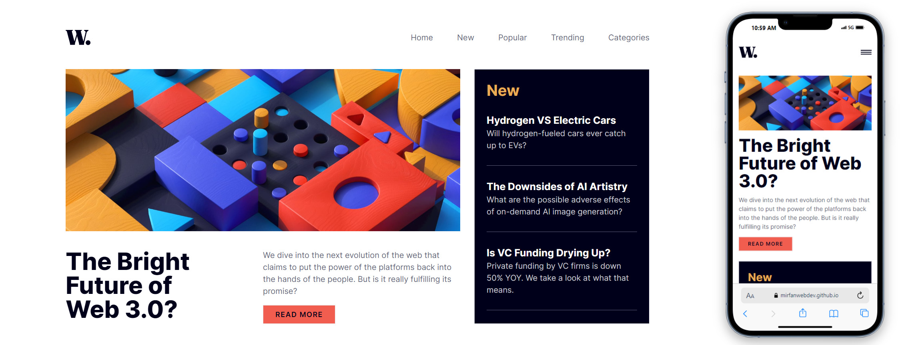

# Frontend Mentor - News homepage

This is a solution to the [News homepage challenge on Frontend Mentor](https://www.frontendmentor.io/challenges/news-homepage-H6SWTa1MFl). Frontend Mentor challenges help you improve your coding skills by building realistic projects.

## Table of contents

- [Overview](#overview)
  - [The challenge](#the-challenge)
  - [Screenshot](#screenshot)
  - [Links](#links)
- [My process](#my-process)
  - [Built with](#built-with)
  - [What I learned](#what-i-learned)
- [Author](#author)
- [Acknowledgments](#acknowledgments)

## Overview

### The challenge

Users should be able to:

- View the optimal layout for the interface depending on their device's screen size
- See hover and focus states for all interactive elements on the page

### Screenshot



### Links

- Solution URL: [FrontendMentor](https://www.frontendmentor.io/profile/mirfanwebdev)
- Live site URL: [GithubPages](https://mirfanwebdev.github.io/frontend-mentor-news/)

## My process

### Built with

- Semantic HTML5 markup
- Mobile-first workflow
- Tailwind CSS
- Next.js
- TypeScript

### What I Learned

This webiste project is built with Nextjs and Typescript. For this challenge I try to explore interface on Typescript. It was to make sure the type of each data is appropriate.

```ts
interface TopStories {
  id: number;
  number: string;
  img: StaticImageData;
  name: string;
  content: string;
}
```

## Author

- Website - [M. Irfan](https://mirfandev.tech)
- Frontend Mentor - [@mirfanwebdev](https://www.frontendmentor.io/profile/mirfanwebdev)
- Twitter - [@mirfanwebdev](https://https://twitter.com/mirfanwebdev)
